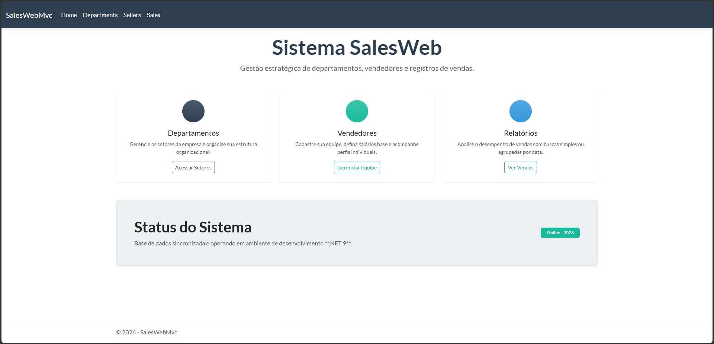
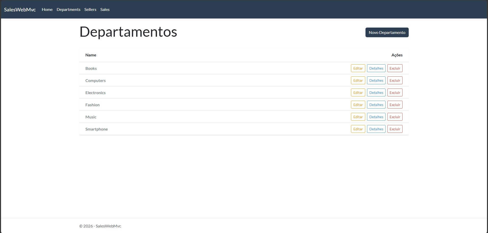
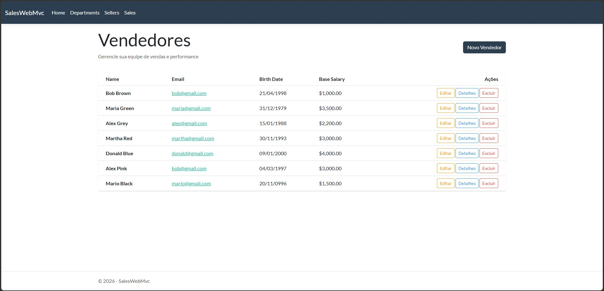
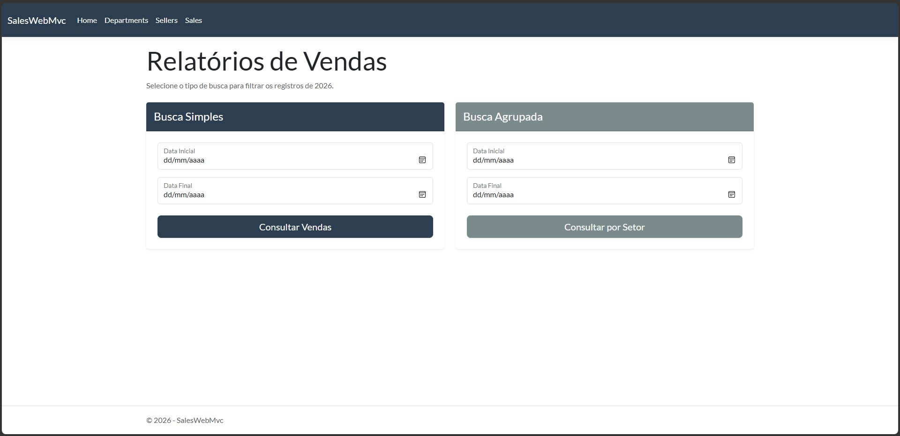
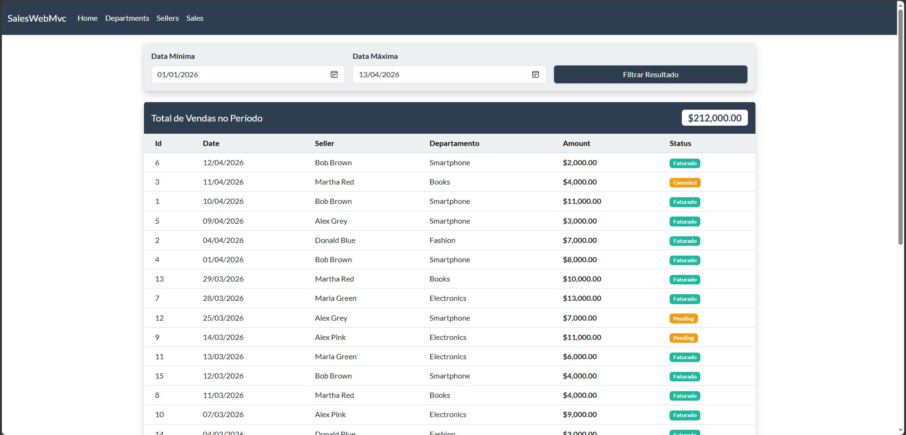

# SalesWebMvc 2026 🚀

O **SalesWebMvc** é uma aplicação completa de gestão de vendas desenvolvida em C# utilizando o padrão de arquitetura MVC (Model-View-Controller). O projeto permite o controle de departamentos, vendedores e o monitoramento detalhado de registros de vendas com filtros inteligentes.

### 📸 Screenshots do Projeto

<table>
  <tr>
    <td align="center"><b>Dashboard Principal</b><br></td>
    <td align="center"><b>Departamentos</b><br></td>
  </tr>
  <tr>
    <td align="center"><b>Gestão de Vendedores</b><br></td>
    <td align="center"><b>Registros de Vendas</b><br></td>
  </tr>
  <tr>
    <td align="center" colspan="2"><b>Busca Simples</b><br></td>
  </tr>
</table>

---

### 🏠 Dashboard Principal
Interface moderna e intuitiva com atalhos rápidos e status do sistema em tempo real.

### 👥 Gestão de Vendedores e Departamentos
CRUD completo com validações de integridade referencial.

### 📊 Relatórios de Vendas
Filtros avançados por data e agrupamento por setor para análise de performance.

---

### 🛠️ Tecnologias e Recursos

* **Backend:** .NET 9 (C#) com ASP.NET Core MVC.
* **Banco de Dados:** MySQL com Entity Framework Core.
* **Frontend:** Razor Pages, Bootstrap 5 (Tema Bootswatch Flatly) e ícones via Bootstrap Icons.
* **Arquitetura:** Camadas de Serviço (Services) separadas da lógica de controle (Controllers).
* **Segurança:** Tratamento de exceções personalizadas para integridade de dados (`IntegrityException`).
* **Localização:** Configurado para suporte a datas e moedas (`Globalization en-US`).

---

### 🚀 Funcionalidades Implementadas

- [x] **CRUD de Departamentos:** Gerenciamento total de setores.
- [x] **Gestão de Vendedores:** Cadastro com vinculação dinâmica a departamentos e cálculos de salários.
- [x] **Sistema de Vendas:** Registro de transações com status (Pendente, Faturado, Cancelado).
- [x] **Busca Inteligente:** Filtros por período de datas e agrupamento por departamento.
- [x] **Seeding Service:** Alimentação automática do banco de dados para testes rápidos.
- [x] **UI/UX Moderno:** Uso de Floating Labels, Cards responsivos e feedbacks visuais com Badges.

---

### 🔧 Como Rodar o Projeto

**1. Clonar o repositório:**
```bash
git clone git@github.com:PaulloMaggio/asp-net-core-mvc.git
